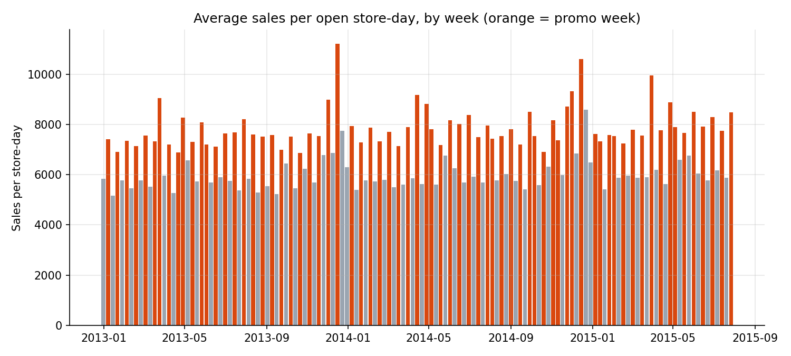
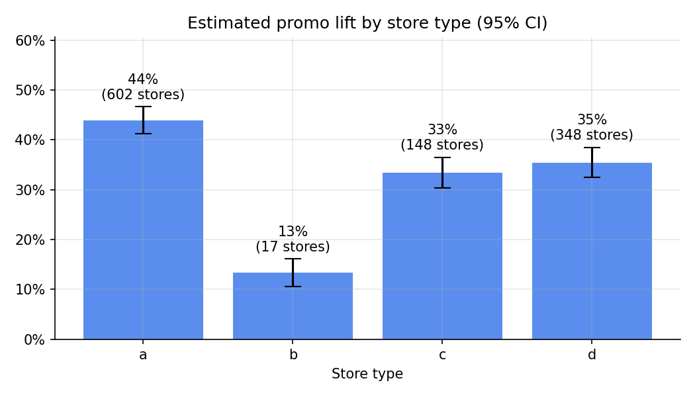
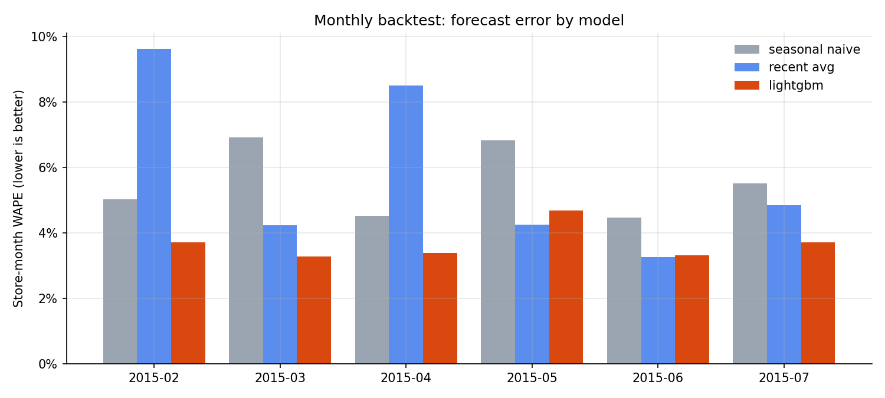
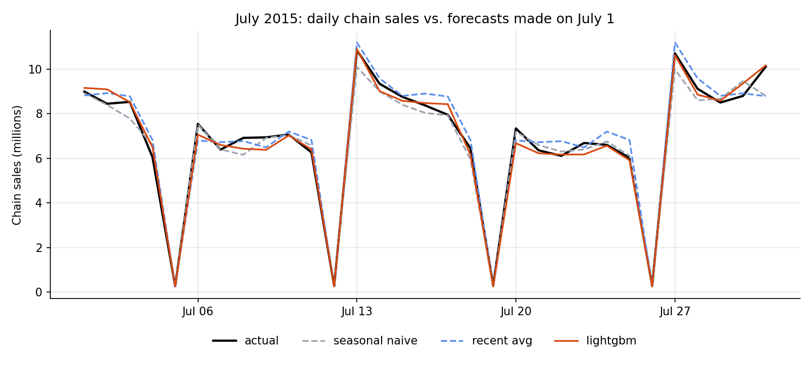
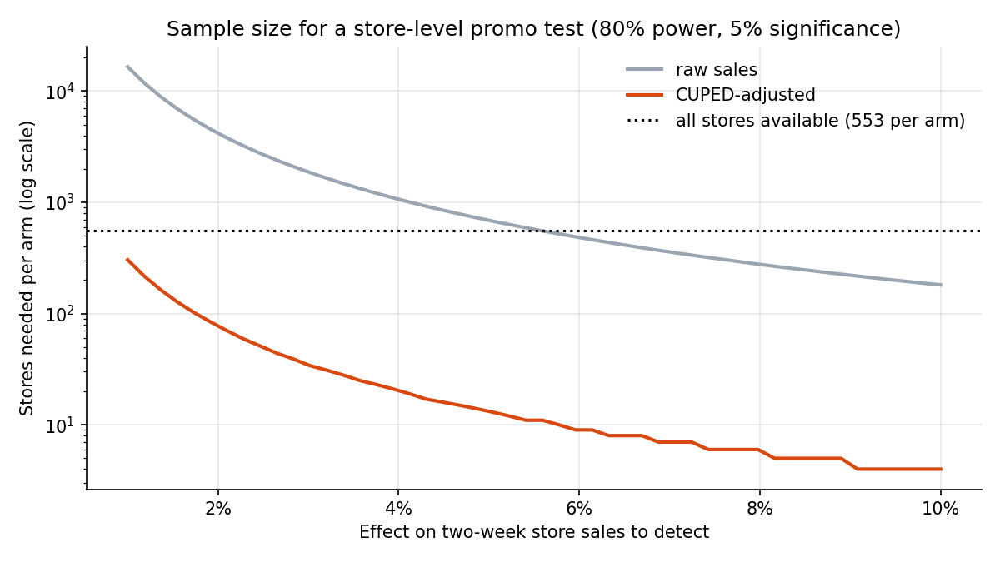

# Forecasting Monthly Sales and Sizing Promotions for a 1,115-Store Retailer

An end-to-end marketing analytics project on 844K store-days of real retail data (Rossmann Store Sales).
It measures how much promotions lift sales, builds and backtests a monthly store-level sales forecast,
sizes upcoming campaigns with scenario forecasts, and designs a statistically powered experiment.

**Tools:** SQL (DuckDB), Python (pandas, statsmodels, LightGBM, SciPy, matplotlib)

## Business questions

1. How much does a promotion lift sales, and does it differ by store format?
2. How accurately can we forecast next month's sales for every store, given the planned promo calendar?
3. What is an upcoming campaign worth: the July promo calendar, and a proposed extra promo week?
4. How would we test a promotion change rigorously, and how many stores would the test need?

## Key results

| Question | Result |
|---|---|
| Promo lift | **+39.3%** sales on promo days (95% CI 36.7% to 42.0%), ranging from 13% to 44% by store type |
| Forecast accuracy | Store-month error (WAPE) of **3.7%** vs. 5.5% for the best baseline, a **34% reduction** across 6 monthly backtests; 97% of store-month forecasts within ±10% |
| Campaign sizing | July promo calendar worth **~30M** in sales (+16.6% vs. no promo); an extra promo week forecast to add **~12M** (+5.7%) |
| Test design | CUPED cut outcome variance by **98%**: detecting a 3% effect needs **35 stores per arm** instead of 1,874. Validated with 2,000 simulated tests |

## Figures


*Average sales per open store-day by week. Promo weeks (orange) alternate with non-promo weeks, and sales peak in December.*


*Estimated promo lift by store type, with 95% confidence intervals.*


*Store-month forecast error in each of six monthly backtests. LightGBM had the lowest error in 4 of 6 months and on average.*


*July 2015 daily chain sales vs. forecasts made on July 1. The LightGBM monthly total was within 0.6% of actual.*


*Stores needed per arm to detect a given effect, with and without CUPED.*

## Approach

**1. Data preparation (SQL).** Loaded 1,017,209 daily records into DuckDB, ran data quality checks, and built a
modeling table of 844,338 open store-days with store attributes, competition, and loyalty-promo features. The
checks found 180 stores with a six-month gap (refurbishment), and showed that promos are switched on for the
whole chain at once.

**2. Promo lift (regression).** Log-linear regression of daily sales on promo status with store fixed effects,
day-of-week, year-month, and holiday controls. Standard errors are clustered by week. Interaction terms estimate
the lift for each store type.

**3. Monthly forecasting (backtest).** Simulated a monthly forecasting process: at the start of each month from
Feb to Jul 2015, trained on all prior data and forecast every open store-day in the month. Compared a seasonal
naive baseline, a 12-week recent-average baseline, and a LightGBM model.

**4. Campaign sizing and test design.** Used the July model to forecast sales under three promo scenarios. Then
estimated how many stores a two-week holdout test would need, using historical 2015 data, with and without CUPED
variance reduction. Checked the design with simulated A/A tests and power simulations.

## Design decisions

- **Rolling-origin backtest, not a random split.** A random split lets the model see the future. Training only on
  data before each month mirrors how the forecast would actually be used.
- **Only features known in advance.** The `Customers` column is excluded because it isn't known before the month
  starts. The "recent level" features use only the three months *before* each row's month.
- **WAPE instead of MAPE.** MAPE blows up on small stores and slow days. WAPE weights errors by sales, which
  matches business impact.
- **Log sales.** Promo effects are multiplicative, so the log model's coefficient reads directly as a percentage lift.
- **Store fixed effects.** Each store is compared with itself, so differences in store size don't bias the estimate.
- **Week-clustered standard errors.** Promos are a chain-wide decision, so the 844K rows contain only about 135
  independent promo decisions. Treating every row as independent would overstate precision.
- **Two-week test window.** Measuring the promo week and the following week counts any post-promo dip against
  the lift.
- **CUPED.** Store size explains most of the variation in store sales. Adjusting each store's outcome by its own
  pre-test sales removes that variation (pre/post correlation 0.99) without biasing the comparison.

## Limitations and next steps

- The lift estimate is observational. Promo weeks could coincide with other events, and the estimate doesn't
  capture purchases pulled forward from later weeks. The regression-based value of the July calendar (35.2M) is
  higher than the LightGBM scenario (30.0M), which suggests a range rather than a single number.
- Back-to-back promo weeks occurred in only 11 of 135 weeks, so the extra-week scenario is partly an
  extrapolation. This is the main reason to run the proposed test.
- If promotions are advertised regionally, the test should randomize by region rather than by store.
- Feature choices were made by comparing variants on the same backtest months, so accuracy is slightly optimistic.
- Next steps: forecast ranges with quantile regression, promo fatigue and post-promo features, and a
  region-level test design.

## How to run

1. Download `train.csv` and `store.csv` from the
   [Rossmann Store Sales competition](https://www.kaggle.com/c/rossmann-store-sales/data) into a `data/` folder.
2. Install dependencies: `pip install -r requirements.txt`
3. Open `promo_forecasting.ipynb` and run all cells (about 5 minutes on a laptop).
   Results may differ very slightly from those above, depending on library versions and CPU threads.

## Project structure

```
├── promo_forecasting.ipynb   # full analysis: SQL prep, lift, forecasting, sizing, test design
├── figures/                  # charts generated by the notebook
├── requirements.txt
└── data/                     # Kaggle files go here (not committed)
```
